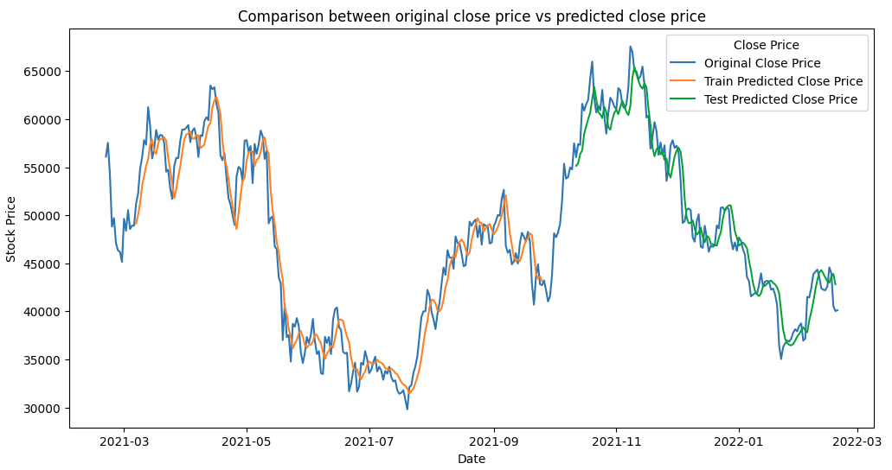

# Bitcoin Price Prediction Project

## Overview

The Bitcoin Stock Price Prediction project using LSTM aims to forecast future Bitcoin prices based on historical data. It involves importing libraries, loading the dataset, performing exploratory data analysis, and building an LSTM model. The model is trained, and its performance is evaluated using metrics like Mean Squared Error. The final step involves comparing actual and predicted stock prices through visualizations.

## Steps

### 1. Importing Libraries

Essential libraries, including Pandas, NumPy, Matplotlib, Seaborn, Scikit-learn, Math, Datetime, Tensorflow, Itertools are imported to facilitate data analysis, visualization, and model building, training and testing.

### 2. Load & Explore Dataset

The bitcoin stock price dataset is loaded, and an initial exploration is conducted to understand its structure, check for missing values, and get basic statistics.

### 3. EDA (Exploratory Data Analysis)

Various EDA techniques are applied:
   - Time Series plots to analyze the tend in bitcoin stock prices.
   - Statistical summaries to provide a view on the key quantitative aspects of the dataset.
   - Line plots to analyze the volatility of bitcoin prices.

### 4. Model Building

In Model Building, the Bitcoin Stock Price dataset is split into features (X) and the target variable (y). After scaling features with MinMaxScaler to maintain consistency, the Long Short-Term Memory (LSTM) model is created. It consists of an LSTM layer for temporal dependencies and a Dense layer for predictions. The model is compiled with mean squared error and the Adam optimizer, setting the stage for training.

### 5. Visualizing Loss

In Visualizing Loss, the LSTM model's performance is monitored by tracking mean squared error loss across epochs. Line plots visualize the training and validation loss, depicting the model's learning process. The training loss reflects errors on training data, while validation loss gauges generalization to unseen data. Monitoring these plots is crucial for effective learning and avoiding overfitting or underfitting.

### 6. Making Predictions

Following the successful training of the LSTM model, it is deployed to make predictions on both the training and testing sets. The model leverages its learned patterns and temporal dependencies to generate sequences of predicted future Bitcoin stock prices. The predictions are then transformed back to the original scale using inverse scaling, providing meaningful insights into the expected price movements.

### 7. Model Evaluation

In Model Evaluation, the LSTM model's performance is assessed using metrics like MSE, RMSE, and MAE, quantifying the difference between predictions and actual Bitcoin stock prices. Evaluation on a testing set measures the model's ability to generalize to new data. A comprehensive understanding of these metrics is crucial for determining the model's effectiveness and reliability.

```python
Train data RMSE:  2148.275566152349
Train data MSE:  4615087.908127194
Train data MAE:  1721.4519993269705
----------------------------------------
Test data RMSE:  2010.7157125895046
Test data MSE:  4042977.676854319
Test data MAE:  1568.5689002653842
```

### 8. Comparison of Predicted vs Actual Bitcoin Price Values

In Comparing Actual vs. Predicted Stock Prices, the final step involves visualizing the model's performance. Line plots overlay actual stock prices with predictions, offering a clear visual representation of the model's alignment with market movements. Insights from this visual assessment contribute to interpreting the LSTM model's efficacy in predicting Bitcoin stock prices.



## Conclusion

### Key Achievements:

1. **Effective Price Prediction:**
   - The LSTM model demonstrated effectiveness in predicting Bitcoin stock prices, capturing temporal dependencies for accurate forecasts.

2. **Insights from EDA:**
   - Exploratory Data Analysis uncovered valuable patterns and trends in the Bitcoin stock price data, enhancing our understanding of market movements.

3. **Optimized Training Process:**
   - The model training process, including visualizing loss and tuning hyperparameters, contributed to an optimized LSTM model, ensuring robust performance.

## How to Run

To run this project on your local environment, follow these steps:

1. Ensure you have the required libraries installed. You can install them using pip:

   ```bash
   pip install numpy pandas matplotlib seaborn scikit-learn math datetime tensorflow itertools
   ```
2. Download the  and place it in the directory.
3. Execute the provided Python script to run the project.

### Future Work

1. **Ensemble Models:**
   - Investigate the potential of ensemble models beyond LSTM, such as combining predictions from multiple LSTMs or integrating with other time series models. Evaluate if ensemble techniques enhance prediction accuracy.

2. **Feature Engineering:**
   - Further explore feature engineering possibilities to extract additional meaningful patterns from the Bitcoin stock price data. Consider incorporating external factors or creating derivative features to capture more intricate relationships.

3. **Advanced Time Series Models:**
   - Explore the implementation of advanced time series models beyond LSTM. Consider experimenting with models like Gated Recurrent Units (GRU) or Transformer-based architectures to assess their performance in capturing temporal dependencies.
