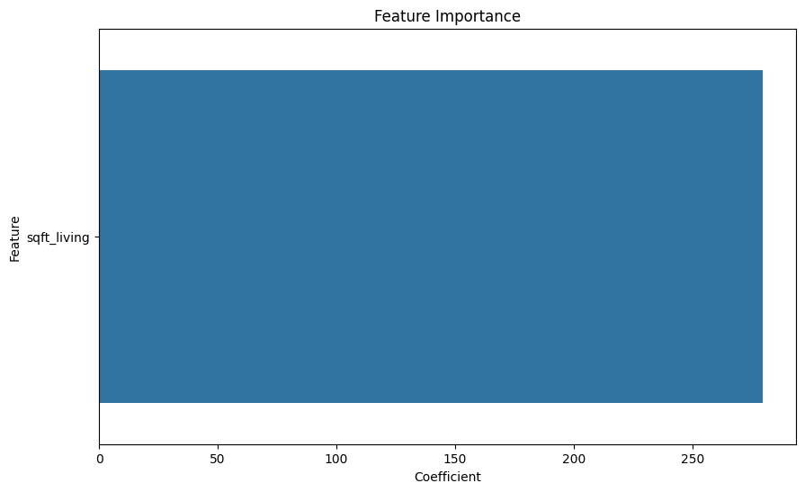
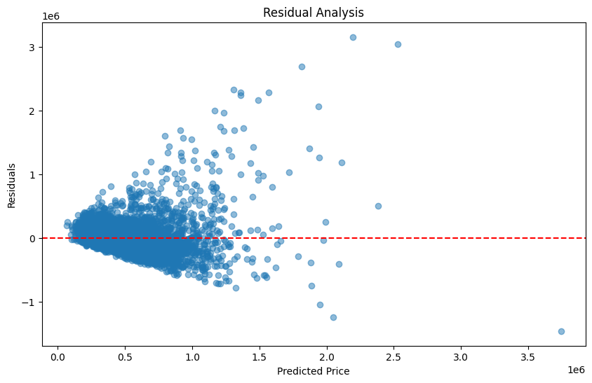
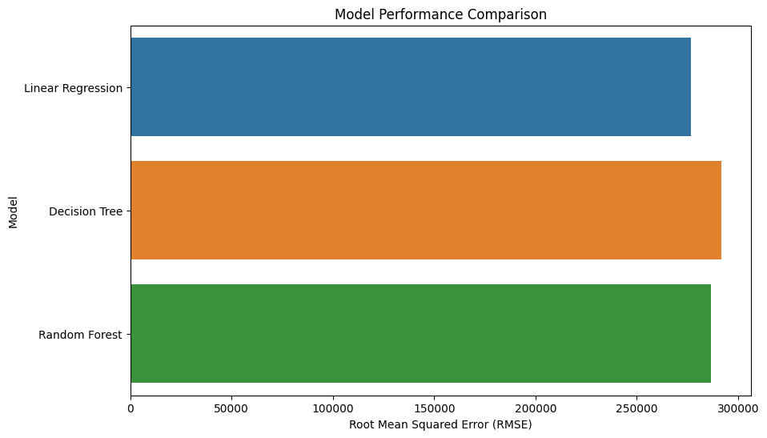
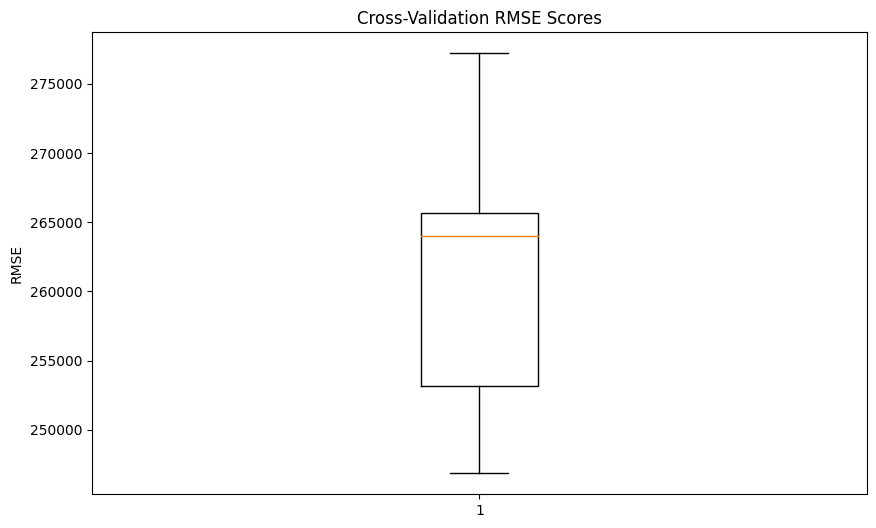
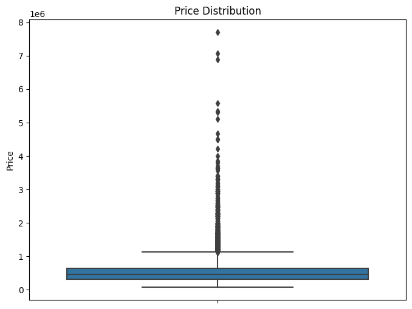

# House Price Prediction Project

## Overview

This project aims to predict house prices using machine learning techniques. The primary objective is to develop a regression model capable of accurately estimating house prices based on various features. The project encompasses critical stages such as data preprocessing, exploratory data analysis (EDA), model building, and thorough evaluation.

## Steps

### 1. Importing Libraries

Essential libraries are imported to facilitate data manipulation, visualization, and machine learning tasks. These include `numpy`, `pandas`, `matplotlib`, `seaborn`, `train_test_split`, `LinearRegression`, and `mean_squared_error`.

### 2. Load Dataset

The dataset, 'house_price_prediction.csv', is loaded into a Pandas DataFrame (`df`), serving as the foundation for subsequent analysis and model training.

### 3. EDA on the Dataset

Exploratory Data Analysis (EDA) involves a comprehensive examination of the dataset. This includes analyzing summary statistics, creating visualizations like correlation matrices, distribution plots, pair plots, and more to gain profound insights into the data's characteristics and relationships.

### 4. Model Building

#### Data Preprocessing
- Features (`X`) and the target variable (`y`) are defined, ensuring a clear distinction between input features and the variable to predict.
- The dataset is split into training and testing sets using `train_test_split` to facilitate model training and evaluation.
- A Linear Regression model is chosen for its simplicity and effectiveness in regression tasks, and it is trained on the training set.

#### Model Evaluation
- Predictions are made on the test set, and performance metrics such as mean squared error (MSE) and root mean squared error (RMSE) are calculated to assess the model's accuracy.

### 5. Model Testing

The trained model is put to the test, visualizing its predictions against actual prices using scatter plots. The R-squared score, a measure of the model's goodness of fit, is calculated to further evaluate its performance.

### 6. Output Presentation

#### a) Feature Importance
- The significance of each feature in predicting the target variable is visualized through a bar plot. This provides valuable insights into which features play a crucial role in determining house prices.

  

#### b) Residual Analysis
- Residuals, the differences between predicted and actual values, are analyzed using a scatter plot. Understanding residuals aids in identifying patterns or anomalies in the model's predictions.

  

#### c) Model Performance Comparison
- The performance of the Linear Regression model is compared with Decision Tree and Random Forest models. This comparison helps in understanding how different algorithms perform on the given dataset.

  

#### d) Cross-Validation Results
- Cross-validation is employed to assess the model's generalization performance. Root Mean Squared Error (RMSE) scores are visualized to provide a comprehensive view of the model's consistency across different folds of the data.

  

#### e) Feature Engineering Insights
- The impact of feature engineering, such as creating a new feature 'total_rooms', on model performance is evaluated. This step explores how additional features can enhance predictive power.

  ```python
  Root Mean Squared Error with Feature Engineering: 273394.6285434443
  ```

#### f) Outlier Analysis
- A box plot is generated to visualize the distribution of house prices. Outliers are identified and removed using the Interquartile Range (IQR) method, and the model is re-evaluated without outliers.

  

## Conclusion

The House Price Prediction project concludes with a thorough evaluation of the model's performance, encompassing key findings and insights derived from the exploratory data analysis and model assessment.

### Key Findings:

1. **Exploratory Data Analysis (EDA):**
   - Exploratory Data Analysis (EDA) provided valuable insights into the dataset. Correlation matrices and visualizations allowed a deeper understanding of feature relationships, distributions, and patterns within the data.

2. **Model Performance:**
   - The Linear Regression model demonstrated strong predictive accuracy, effectively capturing the linear relationships between features and house prices. However, it showed sensitivity to outliers, impacting the model's robustness in extreme cases.

3. **Feature Importance:**
   - Feature importance analysis highlighted the significance of certain features, such as 'square footage.' These features played a crucial role in predicting house prices, indicating their importance in influencing the model's outcomes.

4. **Outlier Analysis:**
   - The removal of outliers had a positive impact on model robustness. By addressing extreme data points, the model's stability and generalization to new data were improved, showcasing the importance of outlier handling in regression tasks.

## How to Run

To run this project on your local environment, follow these steps:

1. Ensure you have the required libraries installed. You can install them using pip:

   ```bash
   pip install numpy pandas matplotlib seaborn scikit-learn
   ```
2. Download the dataset 'house_price_prediction.csv' and place it in the project directory.

3. Execute the provided Python script to run the project.

## Future Work

### 1. Feature Engineering:

Explore additional features or transformations to further enhance the model's predictive power. This could include creating new features based on existing ones, incorporating external datasets, or exploring advanced techniques like polynomial features.

### 2. Model Optimization:

Experiment with different regression algorithms and hyperparameter configurations for continuous model improvement. Consider trying more advanced models such as decision trees, random forests, or gradient boosting to capture complex relationships within the data.

### 3. Deployment:

Explore the possibility of deploying the trained model in a real-world setting for practical applications. This could involve integrating the model into a web application, mobile app, or any platform where users can interact with and benefit from the predictive capabilities of the model.

### 4. Continuous Monitoring:

Implement a system for continuous model monitoring and updating based on new data. Regularly assess the model's performance over time, and if necessary, retrain the model with fresh data to ensure it remains accurate and relevant.
