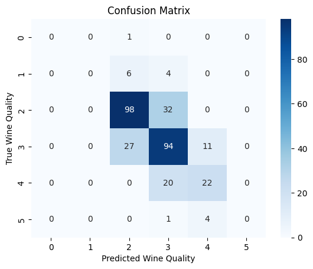
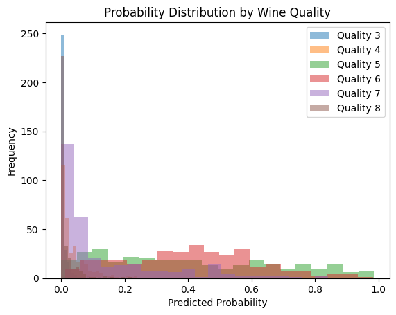

# Wine Quality Prediction Project

## Overview

This project focuses on predicting the quality of wines using a machine learning model. The dataset contains various features related to wine composition, and the goal is to build a model that can classify wines into different quality categories. The project involves data exploration, preprocessing, model building, hyperparameter tuning, and evaluation.

## Steps

### 1. Importing Libraries

Essential libraries, including Pandas, NumPy, Matplotlib, Seaborn, Scikit-learn, and RandomForestClassifier, are imported to facilitate data analysis, visualization, and machine learning.

### 2. Load & Explore Dataset

The wine quality dataset is loaded, and an initial exploration is conducted to understand its structure, check for missing values, and get basic statistics.

### 3. EDA (Exploratory Data Analysis)

Various EDA techniques are applied:
   - Histograms to visualize the distribution of wine quality.
   - Correlation matrix heatmap to understand feature relationships.
   - Box plots to explore the relationship between wine quality and individual features.
   - Pair plots to visualize relationships between selected features.

### 4. Data Preprocessing

The dataset is split into features (X) and the target variable (y). Data is further split into training and testing sets. Feature scaling is applied using StandardScaler.

### 5. Choose a Machine Learning Algorithm

A Random Forest Classifier is chosen as the machine learning algorithm for wine quality prediction.

### 6. Train the Model

The Random Forest Classifier is trained on the training data.

### 7. Hyperparameter Tuning

GridSearchCV is utilized for hyperparameter tuning, searching for the best combination of hyperparameters to optimize model performance.

```python
Best Hyperparameters: {'max_depth': 20, 'min_samples_leaf': 2, 'min_samples_split': 2, 'n_estimators': 50}
```

### 8. Model Evaluation

The trained model is evaluated using accuracy, confusion matrix, and classification report metrics on the test data.

```python
1.) Accuracy: 0.66875

2.) Confusion Matrix:
 [[ 0  0  1  0  0  0]
 [ 0  0  6  4  0  0]
 [ 0  0 98 32  0  0]
 [ 0  0 27 94 11  0]
 [ 0  0  0 20 22  0]
 [ 0  0  0  1  4  0]]

3.) Classification Report:
               precision    recall  f1-score   support

           3       0.00      0.00      0.00         1
           4       0.00      0.00      0.00        10
           5       0.74      0.75      0.75       130
           6       0.62      0.71      0.66       132
           7       0.59      0.52      0.56        42
           8       0.00      0.00      0.00         5

    accuracy                           0.67       320
   macro avg       0.33      0.33      0.33       320
weighted avg       0.64      0.67      0.65       320
```

### 9. Model Assessment

   - **Confusion Matrix Heatmap:** Visual representation of predicted vs. true wine quality.

     
     
   - **Probability Distribution:** Histograms showing the predicted probabilities for different wine quality categories.

     

## Conclusion

### Key Achievements:

1. **Accurate Classification:**
   - The Random Forest Classifier demonstrated accuracy in predicting wine quality categories.

2. **Insights from EDA:**
   - Exploratory Data Analysis provided valuable insights into the distribution of wine quality and feature relationships.

3. **Optimized Model:**
   - Hyperparameter tuning improved the model's performance, resulting in better predictions.

## How to Run

To run this project on your local environment, follow these steps:

1. Ensure you have the required libraries installed. You can install them using pip:

   ```bash
   pip install numpy pandas matplotlib seaborn scikit-learn
   ```
2. Download the  and place it in the directory.
3. Execute the provided Python script to run the project.

### Future Work

1. **Ensemble Models:**
   - Experiment with other ensemble models and compare their performance with the Random Forest.

2. **Feature Engineering:**
   - Explore additional features or transformations to enhance the model's predictive power.

3. **Wine Quality Prediction API:**
   - Develop an API for real-time predictions based on the trained model.
